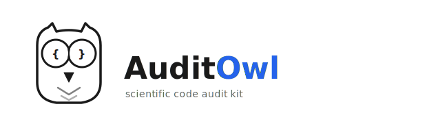

<p align="center">
  <picture>
    <source media="(prefers-color-scheme: dark)" srcset="assets/auditowl-logo-white.svg">
    
  </picture>
</p>

**A prompt and reference library for auditing the code behind a scientific paper.** Point a reasoning agent at a paper PDF and its code repository, get back an `audit.md` that flags potential methodological problems (data leakage, weak baselines, invalid statistics, irreproducibility), missing code, differences between code and paper, technical bugs etc. with `file:line` citations for every finding so it can be easily verified.


## Quickstart: review a paper and its code with an LLM

1. **Make a working folder** with the inputs side by side:

   ```
   my-audit/
   ├── repo/             # git clone of the target repository
   ├── paper.pdf         # download the paper (agents are usually blocked from doing that themselves)
   ├── data/             # optional, for better results. You can also ask the agent to fetch all datasets.
   └── supplement.pdf    # optional, any supplementary files (agents are usually blocked from doing that themselves)
   ```

   Agents are usually blocked from journal websites, so download PDFs manually. If available, also add all available data and any supplements of the paper.

2. **Open the folder with an agentic coding tool.** Recommended: [Claude Code](https://claude.com/claude-code) or [OpenAI Codex CLI](https://openai.com/codex) with the strongest model backends (Opus 4.7, gpt-5.5). Both require a paid subscription (Claude Pro/Max or ChatGPT Plus/Pro/Team) or API credits. Small or local models are usually not strong enough and are therefore not recommended. You can also use IDE addons like the VSCode Claude addon.

3. **Use the prompt.** Paste the contents of [`audit-prompt.md`](audit-prompt.md) into your agent (or load it via `--prompt-file audit-prompt.md`). With `./repo/` and `./paper.pdf` in the working folder, the agent reads the prompt and starts auditing.

   Two versions are available, pick one:
   - [`audit-prompt.md`](audit-prompt.md): the **full** prompt. ~9,500 tokens, with details about common error modes and an anti-pattern grep checklist. Use for thorough audits e.g., for a proper scientific review or before submitting your own paper.
   - [`audit-prompt-lite.md`](audit-prompt-lite.md): a **lite** version, ~2,000 tokens. Covers the essentials without detail about common errors. Use for first-try audits, or when token cost matters.

4. **Guide the agent with follow-up questions.**
   - **Supply domain context it lacks.** *"This biomarker is measured post-treatment, so it can leak the outcome. Check the severity."*
   - **Ask for targeted deeper checks.** *"Run a naive drug-mean baseline and report the gap to the proposed model."*
   - **Raise concerns it missed.** *"Check whether the test split respects patient-level grouping."*
   - **Add context.** *"I pasted a recent benchmark paper in the folder, why are the performance values in the audited paper much higher?"*


5. **Verify each finding.** Before relying on any flagged issue, open the cited `file:line`, check that the quote matches, and decide whether the concern actually holds. The models hallucinate and sometimes overstate severity. Treat unverified findings as questions, not verdicts. **A final review must not contain unverified agent output.**


## What's in this repo

- [`audit-prompt.md`](audit-prompt.md): the full audit prompt (~9,500 tokens). Self-contained, paste it into your agent or load via `--prompt-file`.
- [`audit-prompt-lite.md`](audit-prompt-lite.md): a lite version of the prompt (~2,000 tokens) with fewer details, cheaper to run.
- [`references/findings-schema.md`](references/findings-schema.md): the structured-output schema (so you can machine parse the findings).
- [`references/sources.md`](references/sources.md): consolidated bibliography of the literature the scientific audit prompt is built on.
- [`references/leakage/`](references/leakage/), [`references/forensics/`](references/forensics/): sub-skill references for specific more detailed audit checks. This is work in progress and contributions are welcome. You can load them on demand based on what the paper reports. The three included references are examples of the format:
  - [`leakage/preprocessing-leakage.md`](references/leakage/preprocessing-leakage.md): test data leaking through preprocessing fit on the full dataset.
  - [`forensics/grim-sprite.md`](references/forensics/grim-sprite.md): GRIM / GRIMMER / SPRITE checks for impossible `(mean, SD, n)` triples.
  - [`forensics/statcheck.md`](references/forensics/statcheck.md): arithmetic consistency of inline NHST statistics in the paper text.
- [`scripts/`](scripts/): runnable check scripts (`check_auc.py`, `extract_findings.py`).

## Tool and model notes

- The prompt assumes the agent can read files, run shell commands, and execute Python.
- Use the largest, most recent model with a long context window. The audit happens once per paper, so pay for the best model. Smaller models miss a lot and hallucinate a lot.
- The agent will want to `pip install`, execute scripts, and write to a workspace. Run in a disposable container, not your main workstation home directory; AuditOwl's agent writes and executes Python scripts, and a malicious paper or repo could attempt prompt injection.
- Do not feed unpublished code to commercial models unless you are the author or have explicit consent by the authors.

## What an audit catches

- **Methodological errors:** data leakage, weak baselines, invalid statistics, problematic hyperparameter tuning, problematic metrics, differences between code and paper etc.
- **Incomplete artefacts:** missing preprocessing, missing baselines, missing ablations, missing figure code, no runnable environment.
- **Technical bugs:** anything from hard-coded paths and broken pipelines to severe conclusion-changing bugs.

## Limitations and risks

- **False negatives.** Agents miss problems that need domain context they do not have. Iterate with follow-up questions using your knowledge of the domain. You can also supply more context, e.g., papers of recent benchmarks.
- **False positives.** LLM agents are motivated reasoners: given an instruction to find problems, they find problems. Verify every finding against cited evidence. **A final review must not contain unverified agent output.**
- **Inaccessible components.** The code review cannot evaluate: closed APIs, restricted datasets, large training runs that need more compute than you have available, embeddings from models not in the repo, etc. Problems from upstream artefacts cannot be evaluated properly in the audit.
- **Non-experts get false confidence.** Agent assistance scales expert verification, it does not create expertise. Be aware of [AI-psychosis](https://en.wikipedia.org/wiki/Chatbot_psychosis). Talk to humans.

## Contributing

If you have written a check you would like to share, or want to add a domain-specific reference (your subfield's leakage patterns, your community's known fabrication signatures, a runnable check script), open a PR. See the included sub-skill references for the expected format.

## License

MIT. See [LICENSE](LICENSE).

## Sources

The main audit prompt is grounded in published literature on ML reproducibility, leakage taxonomies, statistical integrity, and LLM-as-auditor research. See [`references/sources.md`](references/sources.md) for the full bibliography.
